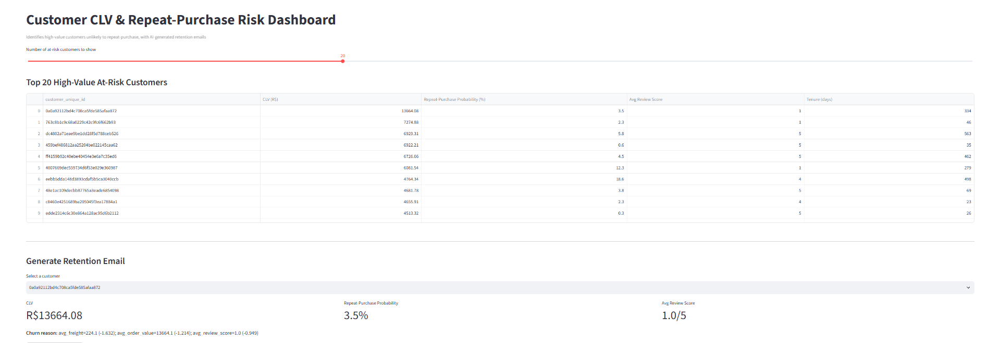
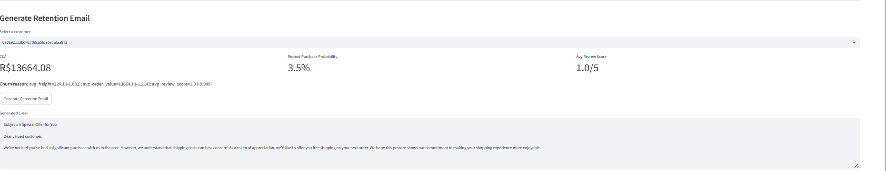
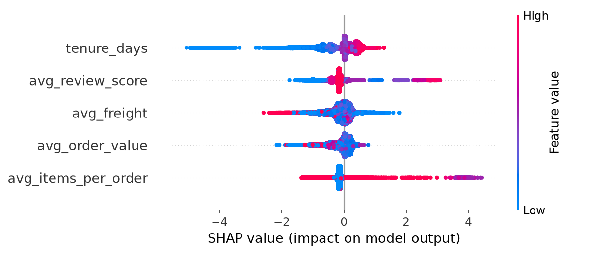
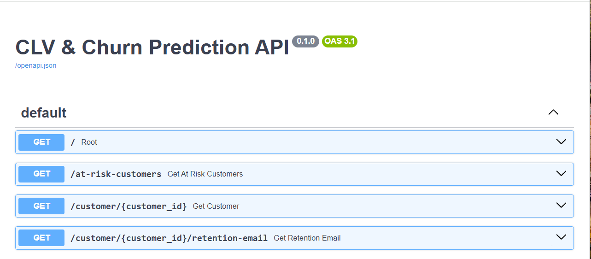

# 🤖 Customer Lifetime Value & Repeat-Purchase Prediction with Explainable AI

An end-to-end ML system predicting customer lifetime value and repeat-purchase likelihood on the
Olist Brazilian e-commerce dataset, with SHAP-based explainability and LLM-generated personalized
retention emails for high-value at-risk customers.

## 📑 Table of Contents

- [Problem](#-problem)
- [Key Findings & Decisions](#-key-findings--decisions)
- [Architecture](#️-architecture)
- [Results](#-results)
- [Tech Stack](#️-tech-stack)
- [Project Structure](#-project-structure)
- [Setup](#-setup)
- [Running the Pipeline](#️-running-the-pipeline)
- [Screenshots](#-screenshots)
- [Future Improvements](#-future-improvements)

## 📖 Problem

E-commerce businesses lose revenue when high-value customers don't return. This project identifies
which customers are unlikely to make a repeat purchase, explains *why* using SHAP, and auto-generates
a tailored retention email addressing each customer's specific risk factor.

## 💡 Key Findings & Decisions

- **Reframed "churn" as "repeat-purchase prediction"**: Olist's dataset shows only ~3% of customers
  place a second order — consistent with published research on this dataset. Traditional recency-based
  churn labels don't apply meaningfully here, so the target was redefined as `frequency > 1`.
- **Caught and fixed two data leakage issues**:
  - `recency_days` (time since last order) trivially correlates with repeat-purchase, since a
    customer's "last order" is naturally recent if they ordered again — dropped from features.
  - `avg_order_value` is nearly identical to `clv_target` for single-purchase customers (97% of the
    dataset) — dropped from CLV model features.
- **Business-relevant evaluation**: given severe class imbalance (3% positive rate), used AUC-ROC,
  PR-AUC, and Precision@K instead of raw accuracy.

## 🏗️ Architecture

```
Olist Dataset
      │
      ▼
Data Cleaning
      │
      ▼
Feature Engineering (RFM)
      │
      ▼
XGBoost Models
├── Repeat-Purchase Classifier
└── CLV Regressor
      │
      ▼
SHAP Explainability
      │
      ▼
Groq (Llama 3.3) Retention Emails
      │
      ▼
FastAPI
      │
      ▼
Streamlit Dashboard
```

## 📊 Results

- **Repeat-purchase model**: AUC-ROC 0.807, PR-AUC 0.436 (vs 0.03 random baseline)
- **Business impact**: targeting the top 5% of customers by predicted score yields an 8.8x lift over
  random targeting (26.5% vs 3.0% baseline precision)
- **CLV model**: R² 0.24, MAE ₹75.81 — using only indirect behavioral signals (tenure, reviews, items
  per order, freight), deliberately excluding direct spend history to avoid leakage

## ⚙️ Tech Stack

| Component | Role |
|:----------|:-----|
| Python, Pandas, NumPy | Data cleaning and feature engineering |
| XGBoost | Repeat-purchase classification and CLV regression |
| SHAP | Per-customer explainability |
| Groq (Llama 3.3 70B) | AI-generated personalized retention emails |
| FastAPI | Backend API |
| Streamlit | Interactive dashboard |
| Docker | Containerized deployment |

## 📂 Project Structure

```
clv-churn-predictor/
│
├── data/                       # Raw + processed data (not committed)
├── src/
│   ├── data_cleaning.py
│   ├── feature_engineering.py
│   ├── churn_model.py
│   ├── clv_model.py
│   ├── explainability.py
│   ├── retention_email.py
│   ├── api.py
│   └── dashboard.py
├── screenshots/
├── Dockerfile
├── requirements.txt
├── .env.example
└── README.md
```

## 🚀 Setup

Clone the repository and install dependencies.

```bash
pip install -r requirements.txt
```

Download the [Olist Brazilian E-Commerce Dataset](https://www.kaggle.com/datasets/olistbr/brazilian-ecommerce)
into the `data/` directory.

Create a `.env` file:

```
GROQ_API_KEY=your_groq_api_key
```

## ▶️ Running the Pipeline

```bash
python src/data_cleaning.py
python src/feature_engineering.py
python src/churn_model.py
python src/clv_model.py
python src/explainability.py
python src/retention_email.py
```

Start the API:

```bash
uvicorn src.api:app --reload
```

Start the dashboard (in a separate terminal):

```bash
streamlit run src/dashboard.py
```

## 📸 Screenshots

### Dashboard



### AI Retention Email



### SHAP Explainability



### FastAPI Documentation



## 🔮 Future Improvements

- Real-time incremental feature updates as new orders come in
- A/B testing framework to measure actual retention email effectiveness
- Multi-language email generation (Portuguese, given Olist is Brazilian)
- Model monitoring for feature/prediction drift over time
